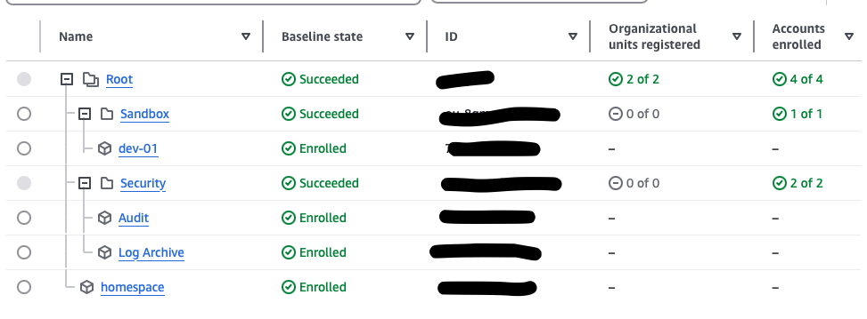
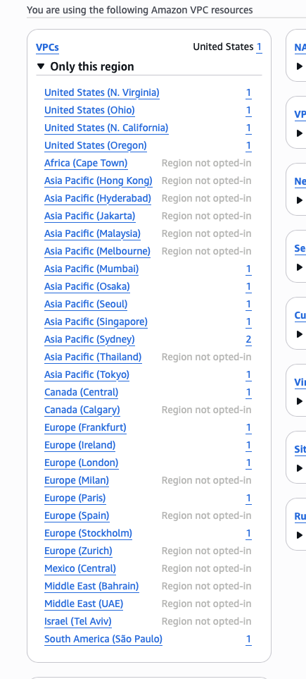
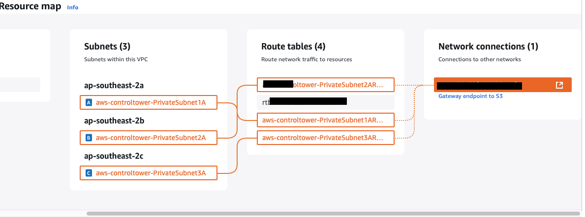

# Intro

## Tools

This post describes the steps taken to setup an AWS landing zone that aligns to best practices and the well architected framework. Including some details that are harder to find in the docs and are good to know before attemting. The second goal is to enable aws Cloud Development kit (CDK) provisioning of resources after creation of the basic Organisational Units (OUs), Accounts, and Landing Zone standard resources.

### AWS Control Tower and Landing Zone

Control Tower is a service used to manage OUs, Accounts, policies and other high level governance entities within your AWS footprint. In this blog I wont be going into details on what things are, since that is already documented. 

https://docs.aws.amazon.com/controltower/latest/userguide/what-is-control-tower.html

The Landing Zone is just a combination of OUs, Accounts and policies that make up an initial AWS deployment from the control tower, it is described here.
https://docs.aws.amazon.com/prescriptive-guidance/latest/migration-aws-environment/building-landing-zones.html

### Cloud Development Kit

CDK is a IaC tool that sits ontop of Cloudformation (cfn) and can be used in python or typescript to create infrastructure as code. Ideally most infrastructure and cloud resources should be provisioned as code using repeatable libraries and code reviews to check what is being deployed and created.

CDK best practices are here https://docs.aws.amazon.com/cdk/v2/guide/best-practices.html

## Process

This will be rather light on first draft since I am mostly addressing this to my future self, but will flesh out with more pictures and detailed steps if needed.

### The Start

Create an AWS account, this will be the root account.

Login and go to AWS control tower, create an organisation.

Then create a landing zone, this will be a multi step process where you select a bunch of config and values. I wont go through all of them but the important ones I recall are.

**Enable public Subnets** DO NOT SELECT, the landing zone will create a VPC in all valid regions of your accounts, even if you say only one region is your main region, if you enable public subnets, it will create a public subnet with a NAT gateway, potentially in each subnet, this will incur $$.

**OUs** I used the default suggested, securty OU with audit and log archive, then a sandvox OU that dev, prod and other workload accounts can be provisioned. The root account that you create control tower from is the management account, I called it homespace.

**Cloudtrail** I did not enable this since it creates potential cost, though it is best practice.

**emails** for each account you need to use a new email, you can use your existing with a +account added to it, so myemail+audit@gmail.com . Whether this works for all email domains I am not sure.

**IAM identity centre or self managed IAM** I selected self managed, but this is because it is experimental, the permissions and groups may be appropriate for others. In a mature organisation, IAM should involve SSO sign in and assuming roles that are granted to sso authenticated users.

**existing accounts** There is an option to enroll existing accounts, the account that the landing zone is created from becomes the management account and enrolled accounts can be put under any OU.

### Bootstrap

Next thing to do is create an IAM user and role in your management account that is an admin and you can login to instead of the root account. This could potentially also be done before creating the initial landing zone. I bootstrapped the manmagement account then used root user key to provision IAM user and role with admin access then deleted the API key. This could also be done via console. 

Create a user that is allowed to assume a IAM role that has AdministratorAccess aws managed policy

CDK requires a bootstrap to be done to initialise the required resources for running CDK deployments. This creates iam role, s3, ecr, KMS for a single account all in a cfn stack called CDKToolKit. Or you can bootstrap across accounts/region with a trusted deployer account. The bootstrap command needs to be execute from a role within the account that has appropriate permissions.

I bootstrapped the management account with the goal of provisioning further accounts with CDK, this was not necessary since you can't easily do this via CDK and need to use the console. There seems to be some L1 constructs in CDK that might be able to but it is not ideal.

### IAM users and roles

The root user in the managemet account cant enroll new accounts, so the admin user created was used to enroll a new account (dev01). The new account email was used to login as root user initally, you need to forget password for the new account then update it with the email sent. Then login and bootstrap the account via cli and use cdk to create admin roles, or manually create a User/role then bootstrap it. The delete root use access key.

In my setup I gave trusted access across accounts to the management account admin role, and allowed this role to assume the admin role within the dev01 account. This is not as secure as I would do in an enterprise deployment. You would be required to login to the dev01 admin user or an sso authenticated role and assume the appropriate role afterwards.

### Networking (defaults)

Doing an inventory after creating the landing zone is important, as even with minimal regions and config, I found VPCs in almost every region with multiple subnets. All resources created by control tower should be in cfn stacks.

The management account has a default VPC because that is created on account creation I believe.

The following is from the dev01 account created via control towner account enrolling. There are two in Sydney because I used cdk to provision a new one as a test.

These VPCs are based off the networking config in AWS control tower, where you specify subnets, CIDR and a few other values.

Important to note, the default created VPC in Sydney (the region I selected as the only region to dpeloy in) are connected to a S3 VPC endpoint

The rest appear to be default VPCs that have an internet gateway and public subnets.

The S3 endpoint could be for logging or one of the security features?

### Networking (CDK)

Once the dev01 account is bootstrapped and you have a role to do CDK deployments, you can use cdk to deploy whatever you like, be it new IAM roles to manage your access, or networking and compute to start running workloads.

### Logarchive Account

This account has two s3 buckets, for logs and s3 access logs, the log retention period is configured in control tower landing zone setup. The logs bucket would have all the cloudtrail logs going into it I would assume. There are several IAM roles created by control tower.

### Audit Account

This account doesnt have much in it, just the IAM roles I can see. Plus a bunch of cfn stacks similar to other accounts with a few audit specific stacks with IAM roles and SNS resources.

### Budgets

Budgets can be set from within an account, and possibly via AWS control tower, this is a good rundown on them https://aws.amazon.com/blogs/mt/provision-sandbox-accounts-with-budget-limits-to-reduce-costs-using-aws-control-tower/ 

### Secrets

Using secretsmanager with cdk is recommended, you can store the secret id in the cdk.json and fetch it at deployment time.

## Final Thoughts

The process of creating a new account likely will need to be manual, and have some steps on bootstrapping it or creating the minimum required resources to start provisioning and setting up the account via cdk. 
It looks like there are templates/blueprints in control tower that help you manage them and could be provisioned on creation, this could be better to have in IaC but unsure.
